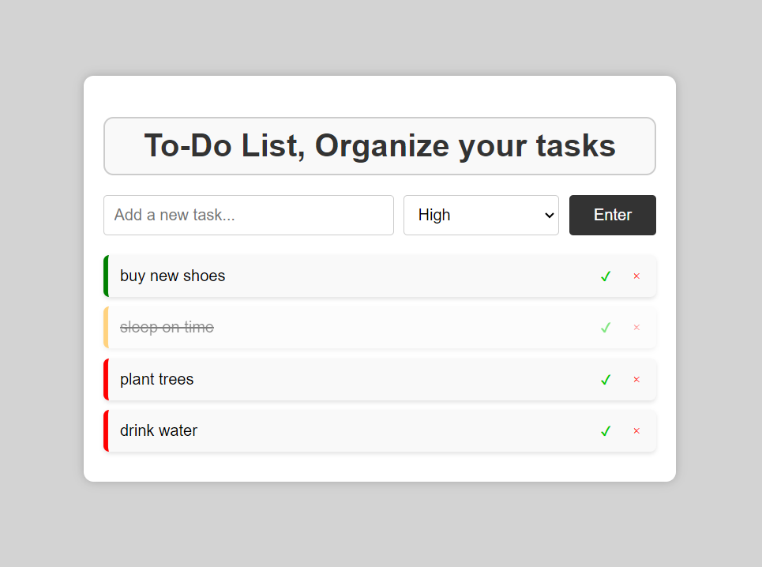
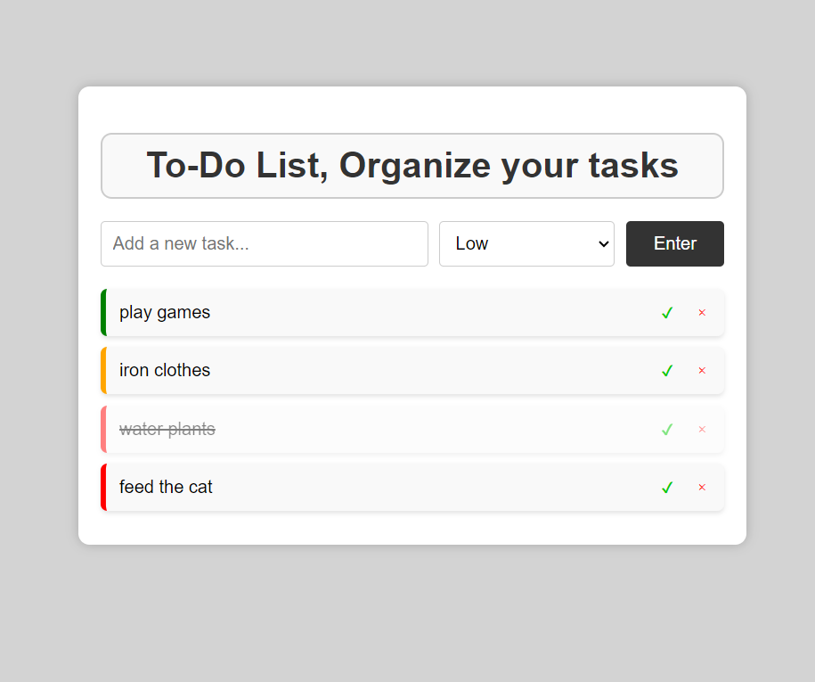

# To-Do List Web Application

## Overview

This is a simple and aesthetically pleasing To-Do List web application built with HTML, CSS, and JavaScript. The application allows users to add tasks with different priority levels, mark tasks as completed, and delete tasks. The tasks are sorted by priority to help users organize and prioritize their work effectively.

## Features

- Add tasks with priority levels (Low, Medium, High)
- Mark tasks as completed
- Delete tasks
- Tasks are sorted by priority
- Responsive design and user-friendly interface

## Demo

You can view the live demo of the application [here](https://miralhsn.github.io/LGMVIP-Web-Task-1/).

## Screenshots




## Setup

Follow these instructions to set up and run the project locally:

1. **Clone the repository:**

    ```sh
    git clone https://github.com/miralhsn/LGMVIP-Web-Task-1.git
    ```

2. **Navigate to the project directory:**

    ```sh
    cd LGMVIP-Web-Task-1
    ```

3. **Open `index.html` in your preferred web browser:**

    You can simply double-click the `index.html` file, or open it from a web server for a better development experience.

## Usage

1. **Add a new task:**
    - Enter the task description in the input field.
    - Select the priority from the dropdown menu (Low, Medium, High).
    - Click the "Enter" button to add the task to the list.

2. **Mark a task as completed:**
    - Click the green checkmark button next to the task.

3. **Delete a task:**
    - Click the red cross button next to the task.

## Contributing

Contributions are welcome! If you have any ideas, suggestions, or issues, please open an issue or submit a pull request.

## License

This project is licensed under the MIT License - see the [LICENSE](LICENSE) file for details.

## Acknowledgements

- Inspired by various online to-do list applications and tutorials.
- Developed as a part of the LGMVIP Web Task.

---

Feel free to reach out if you have any questions or feedback!
